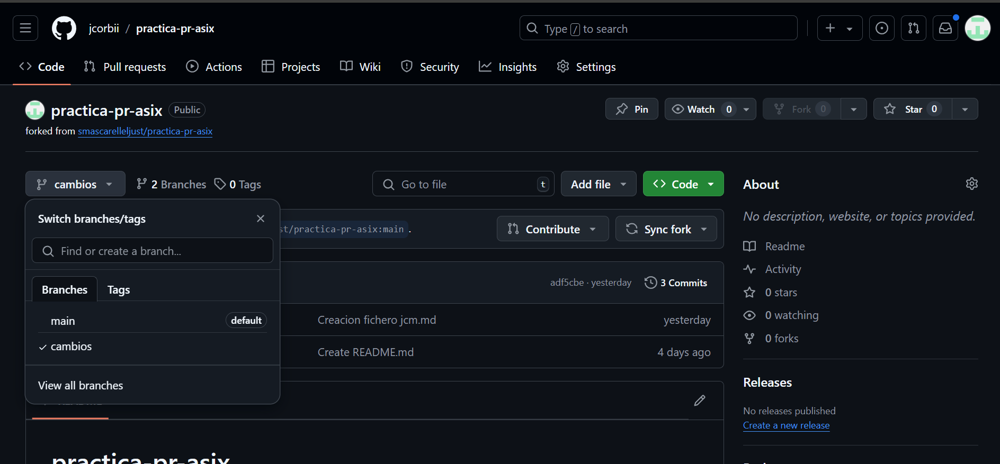

# Práctica 1.2 - Pull Request. ¿Cómo colaborar en un proyecto de software libre?

## Entregar

1. Documentación de los pasos fundamentales (con instrucciones) para realizar el pull request.
   1. Lo primero es hacer un fork del repositorio al que quieres contribuir.
   
   2. Nos creara un nuevo repositorio en la cuenta de el usuario.
     
   3. Una vez que hemos copiado el repositorio a nuestra cuenta, podemos clonar ese repositorio.
   
   Para realizar la clonación ejecutamos:

      ` git clone git@github.com:jcorbii/practica-pr-asix.git `

   5. A continuación vamos a crear una nueva rama, donde realizaremos los cambios que posteriormente propondremos como cambios. Para crear la rama ejecutamos:
   
      ` git checkout -b cambios `
      
      dgfd

