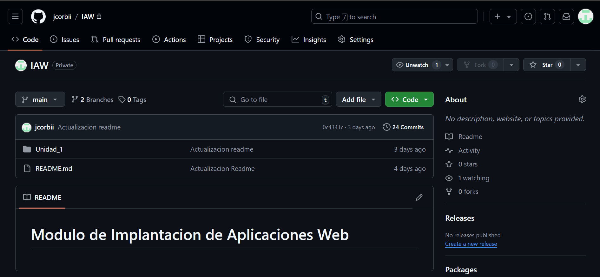
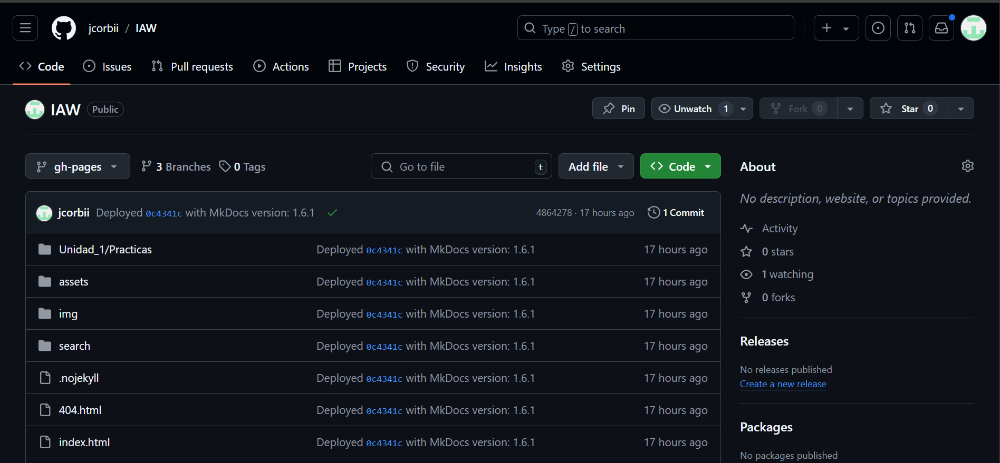
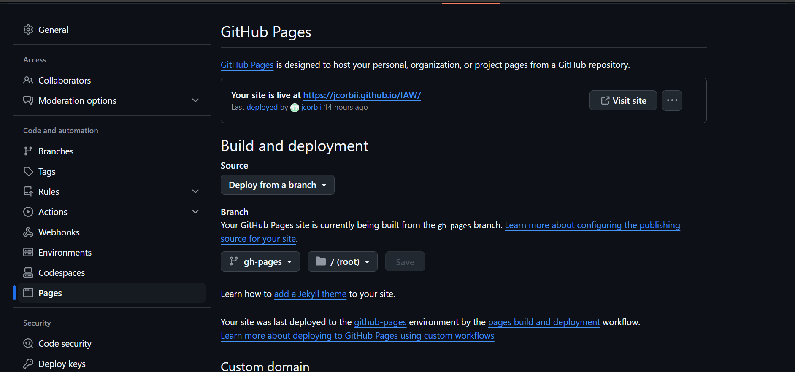

# Práctica 3 - Despliegue de una página web estática con Mkdocs y GitHub Pages

!!! success "Objectivos"

      En esta práctica vamos a desplegar una página web estática con MkDocs en GitHub Pages. Como esta que estás viendo. Para ello, deberás seguir los siguientes pasos:

       - Aprender a utilizar MarkDown
       - Aprender a utilizar MkDocs
       - Aprender a utilizar GitHub Pages
       - Desplegar una página web estática

## Entrega

1. Crea un nuevo proyecto de MkDocs en tu ordenador.
      1. Primero, asegúrate de tener MkDocs instalado en tu ordenador. Si no lo tienes, puedes instalarlo con pip:
   
           > ` $ pip install mkdocs `  
  
      2. Luego, crea un nuevo proyecto de MkDocs usando el siguiente comando:

           > ` mkdocs new web `

           > ` cd web `

    Esto creará una carpeta con el nombre del proyecto y generará una estructura básica con el archivo **mkdocs.yml** (para la configuración) y una carpeta docs que contendrá los archivos **Markdown** para la documentación.

2. Escribe la documentación de tu proyecto en formato Markdown.
   
     La documentacion de el projecto esta ja echa en la practica 1 y la practica 2

3. Genera la página web con MkDocs
   > ` mkdocs new nombre-del-proyecto `
     
     Esto creará una estructura básica de directorios.

     ***Estructura del proyecto MkDocs***

      Dentro del directorio de tu proyecto, verás un archivo **mkdocs.yml** y una carpeta **docs**, donde deberás colocar tus archivos .md.

     ***Añadir documentación***

     Copia tu documentación Markdown a la carpeta **docs**. Asegúrate de que los nombres de los archivos sean claros y representativos.

     ***Configurar mkdocs.yml*** 

     Asegúrate de que tu archivo **mkdocs.yml** tenga la configuración correcta. Aquí hay un ejemplo básico:

4. Crea un repositorio en GitHub para tu proyecto.
   
     Repositorio para mi proyecto.
     

5. Sube la página web a GitHub Pages.
     
     Para subir la pagina web a GitHub Pages ahi que hacer:
     
     ` mkdocs gh-deploy `

     Al hacer el ` gh-deploy ` aparecera en nuestro GitHub una rama que se llamara **gh-pages**.

     

     Luego tendremos que ir a settings y dentro de al apartadado de pages.Y ya solo tenemos que probar si funciona la URL.

     

6. Comprueba que la URL de tu página web en GitHub Pages funciona correctamente.
   
     [URL GitHub](https://jcorbii.github.io/IAW/)
   
