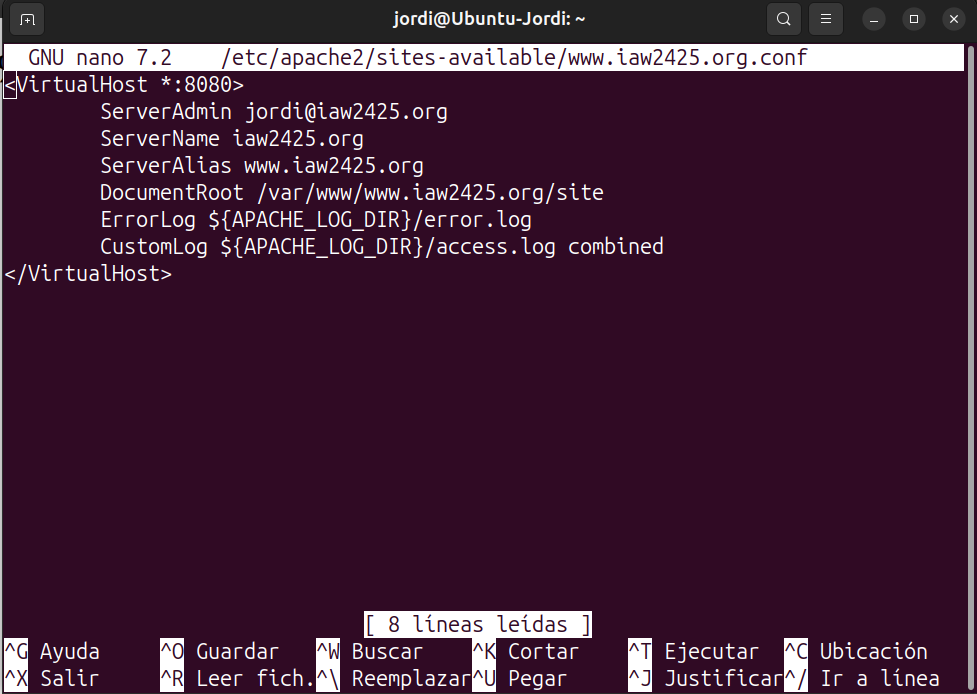
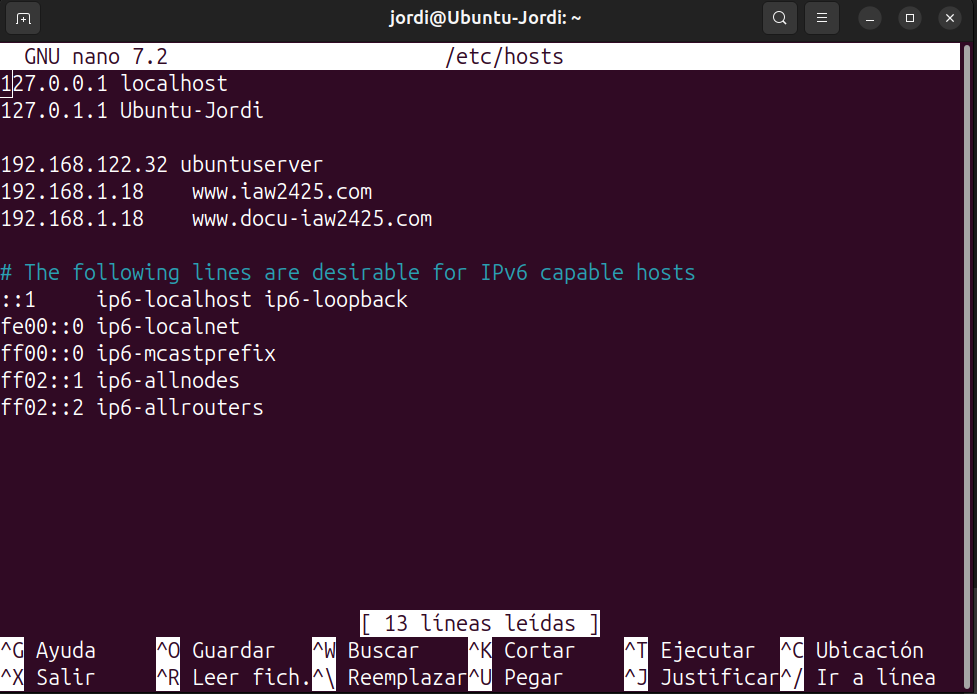
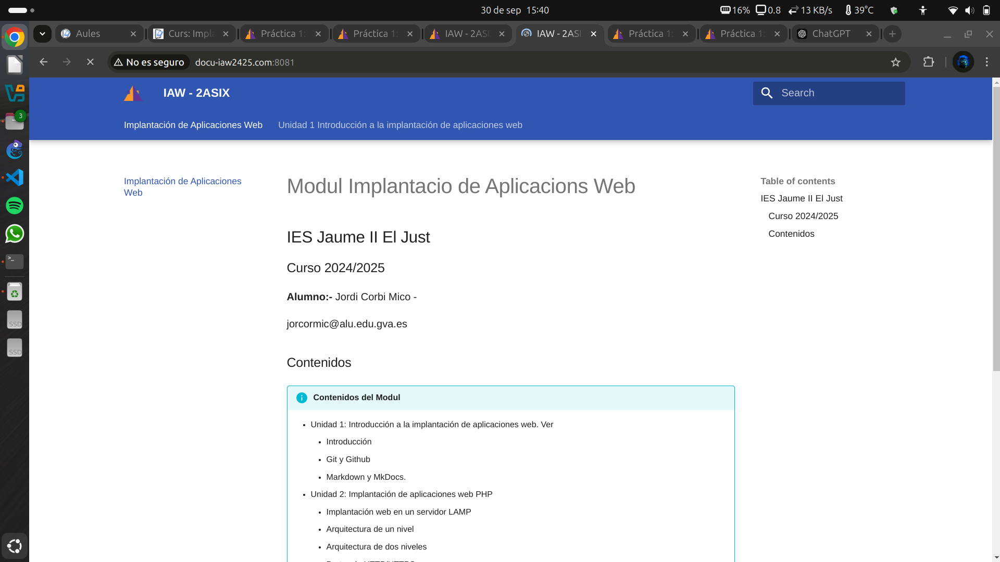

# Practica 1:Implantación de una web estática con Apache

!!! success "Objetivos de la práctica"

    - Instalar y configurar un servidor web Apache2.
    - Crear distintos Host Virtuales en apache2 que nos permiten tener sitios web diferenciados.
    - Acceder a cada Host Virtual con un determinado nombre de dominio.


   
### 1. Configuracio de Host virtuals en Apache2

Crea el directorio para www.iaw2425.org de la siguiente manera:
```bash
$ sudo mkdir -p /var/www/www.iaw2425.org
$ sudo mkdir -p /var/www/www.docu-iaw2425.org
```
A continuación, asigna la propiedad del directorio al usuario con el que has iniciado sesión actualmente con la variable de entorno $USER:
```bash
$ sudo chown -R $USER:$USER /var/www/www.iaw2425.org
$ sudo chown -R $USER:$USER /var/www/www.docu-iaw2425.org
```

### 1.1 Configuracion  pagina www.iaw2425.org

Para la parte de la Web vamos a copiar el ***site*** de nuestra pagina web en ***Mkdocs***. Ya que asi podremos ver algo quando intentemos acceder. 

Para que Apache sirva este contenido, es necesario crear un archivo de host virtual con las directivas correctas. En lugar de modificar el archivo de configuración predeterminado ubicado en `/etc/apache2/sites-available/000-default.conf` directamente, crea uno nuevo en `/etc/apache2/sites-available/www.iaw2425.org.conf`:
```bash
$ sudo nano /etc/apache2/sites-available/www.iaw2425.org.conf
```
```bash
<VirtualHost *:8080>
        ServerAdmin jordi@iaw2425.org
        ServerName iaw2425.org
        ServerAlias www.iaw2425.org
        DocumentRoot /var/www/www.iaw2425.org/site
        ErrorLog ${APACHE_LOG_DIR}/error.log
        CustomLog ${APACHE_LOG_DIR}/access.log combined
</VirtualHost>
```


### 1.2 Configuracion  pagina www.docu-iaw2425.org

Para la parte de la Web vamos a copiar el ***site*** de nuestra pagina web en ***Mkdocs***. Ya que asi podremos ver algo quando intentemos acceder. 

Para que Apache sirva este contenido, es necesario crear un archivo de host virtual con las directivas correctas. En lugar de modificar el archivo de configuración predeterminado ubicado en `/etc/apache2/sites-available/000-default.conf` directamente, crea uno nuevo en `/etc/apache2/sites-available/www.docu-iaw2425.org.conf`:
```bash
$ sudo nano /etc/apache2/sites-available/www.docu-iaw2425.org.conf
```
```bash
<VirtualHost *:8081>
        ServerAdmin jordi@docu-iaw2425.org
        ServerName docu-iaw2425.org
        ServerAlias www.docu-iaw2425.org
        DocumentRoot /var/www/www.docu-iaw2425.org/site
        ErrorLog ${APACHE_LOG_DIR}/error.log
        CustomLog ${APACHE_LOG_DIR}/access.log combined
</VirtualHost>
```


Guarda y cierra el archivo cuando hayas terminado.

Ahora habilita el archivo con la herramienta a2ensite:
```bash
$ sudo a2ensite www.iaw2425.org.conf
$ sudo a2ensite www.docu-iaw2425.org.conf
```
Deshabilita el sitio predeterminado definido en 000-default.conf:
```bash
$ sudo a2dissite 000-default.conf
```
A continuación, prueba si hay errores de configuración:
```bash
$ sudo apache2ctl configtest
```
Deberías recibir la siguiente salida
. . .
Syntax OK
Reinicia Apache para implementar tus cambios:
```bash
$ sudo systemctl restart apache2
```

#### Modificar ficher hosts

Modifiquem el ficher /etc/hosts:
```bash
$ sudo nano /etc/hosts
```


### **Pagina www.iaw2425.org**


### **Pagina www.docu-iaw2425.org**

   
