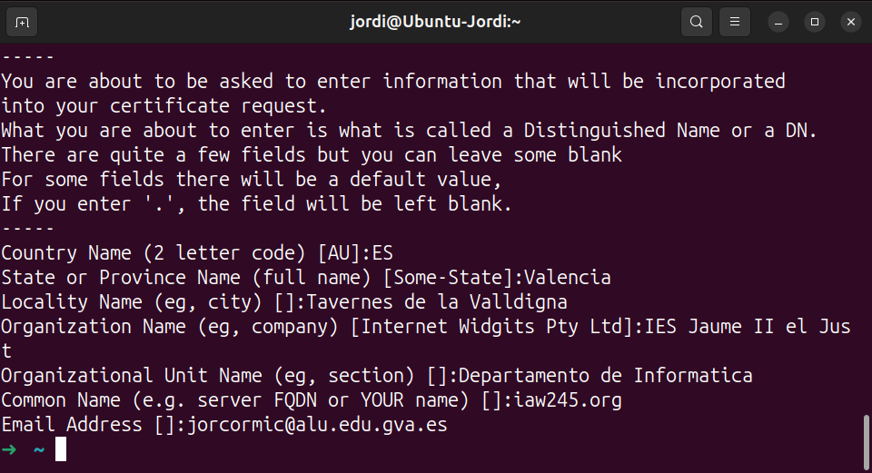
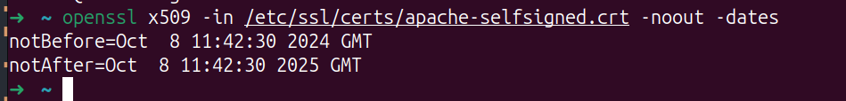
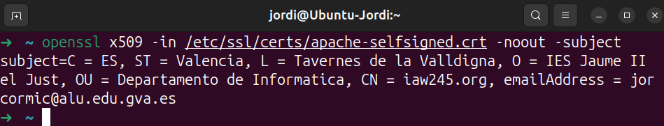
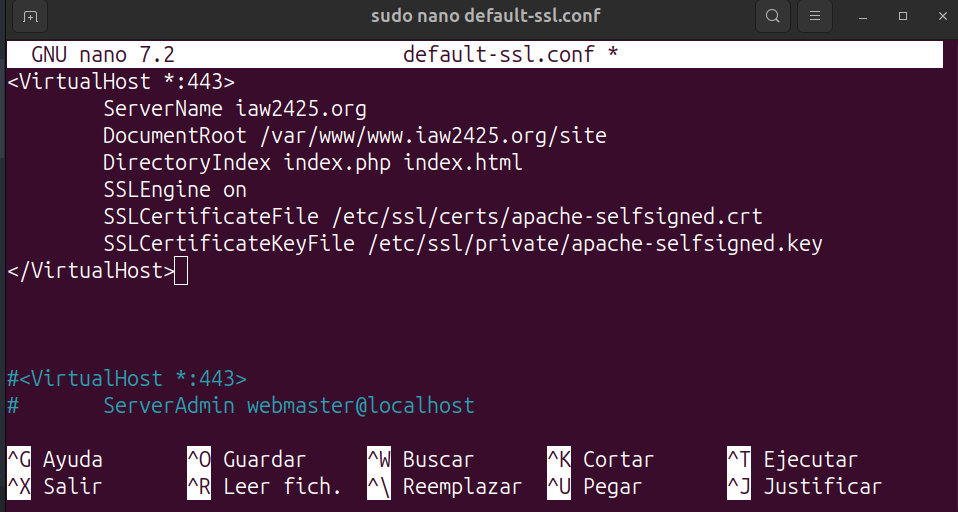
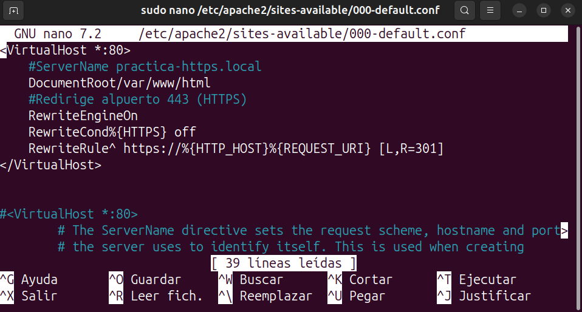
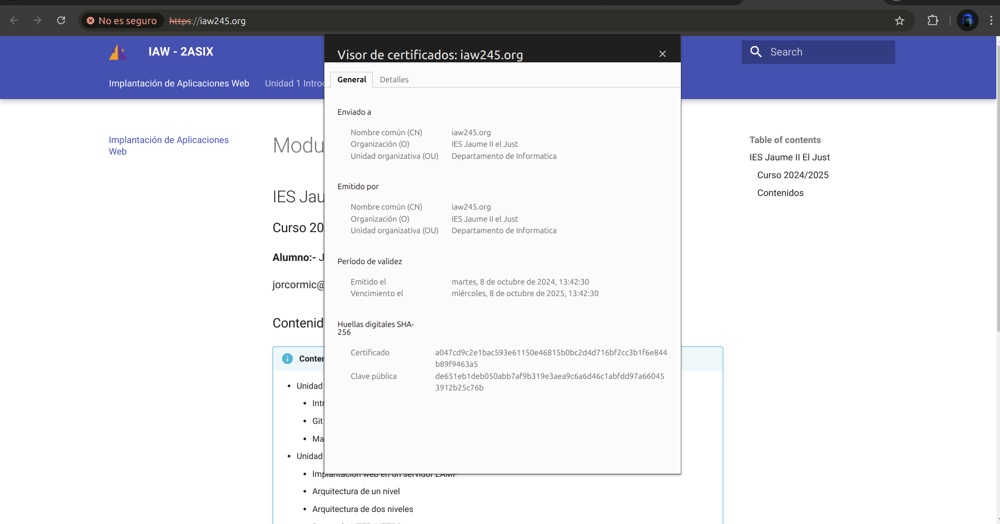

# Practica 2: Certificado SSL/TLS

!!! success "Objetivos de la práctica"
    
    - Crear un certificado SSL/TLS autofirmado con la herramienta openssl.
    - Configurar el servidor web Apache para que utilice el certificado SSL/TLS autofirmado.


## 1.  HTTPS. Creación y configuración de un certificado SSL/TLS autofirmado en Apache
!!! note "Nota"
    El proceso de creación de un certificado autofirmado consta de los siguientes pasos:

    1. Crear una clave privada y un certificado autofirmado.
    2. Configurar la clave privada y el certificado autofirmado en el servidor web.

### 1.1 Instalación del servidor web Apache
En primer lugar deberemos tener instado un servidor web Apache en nuestra máquina.

### 1.2 Creación del certificado autofirmado

Para crear un certificado autofirmado vamos a utilizar la utilid openssl.

Este es el comando que vamos a utilizar:
```bash
$ sudo openssl req -x509 -nodes -days 365 -newkey rsa:2048 -keyout /etc/ssl/private/apache-selfsigned.key -out /etc/ssl/certs/apache-selfsigned.crt
```


Este comando nos genera un certificado autofirmado con una clave privada y un certificado autofirmado.
### 1.3 Cómo automatizar la creación de un certificado autofirmado
Para automatizar la creación de un certificado autofirmado desde un script de Bash, podemos hacer uso del parámetro -subj que nos permite pasar los datos se adjuntan al certificado como argumentos desde la línea de comandos.


**Ejemplo:**
```bash
#!/bin/bash
set -x

# Configuramos las variables con los datos que necesita el certificado
OPENSSL_COUNTRY="ES"
OPENSSL_PROVINCE="Valencia"
OPENSSL_LOCALITY="Tavernes de la Valldigna"
OPENSSL_ORGANIZATION="IES Jaume II el Just"
OPENSSL_ORGUNIT="Departamento de Informatica"
OPENSSL_COMMON_NAME="iaw245.org"
OPENSSL_EMAIL="jorcormic@alu.edu.gva.es"

# Creamos el certificado autofirmado

sudo openssl req -x509 -nodes -days 365 -newkey rsa:2048 -keyout /etc/ssl/private/apache-selfsigned.key -out /etc/ssl/certs/apache-selfsigned.crt -subj "/C=$OPENSSL_COUNTRY/ST=$OPENSSL_PROVINCE/L=$OPENSSL_LOCALITY/O=$OPENSSL_ORGANIZATION/OU=$OPENSSL_ORGUNIT/CN=$OPENSSL_COMMON_NAME/emailAddress=$OPENSSL_EMAIL"
```

### 1.4 Cómo consultar la información del sujeto del certificado
```bash
$ openssl x509 -in /etc/ssl/certs/apache-selfsigned.crt -noout -subject
```

### 1.5 Cómo consultar la fecha de caducidad del certificado
```bash
$ openssl x509 -in /etc/ssl/certs/apache-selfsigned.crt -noout -dates
```

### 1.6 Configuración de un VirtualHost con SSL/TSL en el servidor web Apache.
**Paso 1**

Editamos el archivo de configuración del virtual host donde queremos habilitar el tráfico HTTPS.

En nuestro caso, utilizaremos el archivo de configuración que tiene Apache por defecto para SSL/TLS, que está en la ruta:**/etc/apache2/sites-available/default-ssl.conf.**

El contenido del archivo será el siguiente:
```bash
<VirtualHost *:443>
        ServerName iaw2425.org
        DocumentRoot /var/www/www.iaw2425.org/site
        DirectoryIndex index.php index.html
        SSLEngine on
        SSLCertificateFile /etc/ssl/certs/apache-selfsigned.crt
        SSLCertificateKeyFile /etc/ssl/private/apache-selfsigned.key
</VirtualHost>
```


Las directivas que hemos configurado son:
- : Indica que este virtual host escuchará en el puerto **443** (HTTPS).
- **ServerName**: Indica el nombre de dominio y se utiliza para indicar al servidor web Apache qué peticiones debe servir para este virtual host. En nuestro ejemplo estamos utilizando el dominio practicahttps.local.
- **DocumentRoot**: Es la ruta donde se encuentra el directorio raíz del host virtual.
- **SSLEngine on**: Configuramos que este virtual host utilizará SSL/TLS.
- **SSLCertificateFile**: Indica la ruta donde se encuentra el certificado autofirmado.
- **SSLCertificateKeyFile**: Indica la ruta donde se encuentra la clave privada del certificado autofirmado.

**Paso 2**

Habilitamos el virtual host que acabamos de configurar.
```bash
$ sudo a2ensite default-ssl.conf
```

**Paso 3**

Habilitamos el módulo SSL en Apache.
```bash
$ sudo a2enmod ssl
```

**Paso 4**

Configuramos el virtual host de HTTP para que redirija todo el tráfico a HTTPS.

En nuestro caso, el virtual host que maneja las peticiones HTTP está en el archivo de configuración que utiliza

Apache por defecto para el puerto 80 :/etc/apache2/sites-available/000-**default**.conf.

El contenido del archivo será el siguiente:
```bash
<VirtualHost *:80>
    #ServerName practica-https.local
    DocumentRoot/var/www/html
    #Redirige alpuerto 443 (HTTPS)
    RewriteEngineOn
    RewriteCond%{HTTPS} off
    RewriteRule^ https://%{HTTP_HOST}%{REQUEST_URI} [L,R=301]
</VirtualHost>
```

**Paso 5**

Para que el servidor web Apache pueda hacer la redirección de HTTP a HTTPS es necesario habilitar el módulo rewrite en Apache.
```bash
$ sudo a2enmod rewrite  
```

**Paso 6**

Reiniciamos el servicio de Apache.ç
```bash
$ sudo systemctl restart apache2
```

**Paso 7**

Una vez llegado a este punto, es necesario comprobar que el puerto 443 está abierto en las reglas del firewall para permitir el tráfico HTTPS.


**Paso 8**

Accede desde un navegador web al nombre de dominio que acabas de configurar. En nuesro caso será: https://iaw245.org




