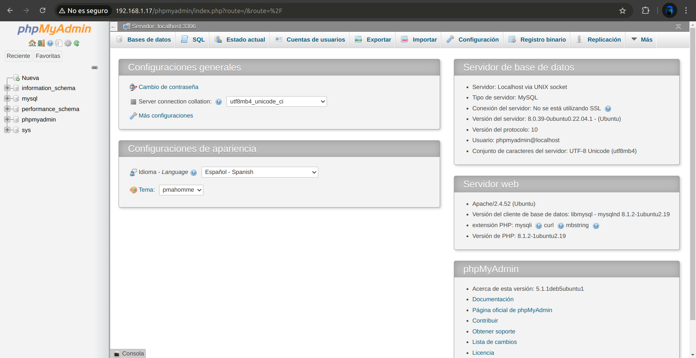
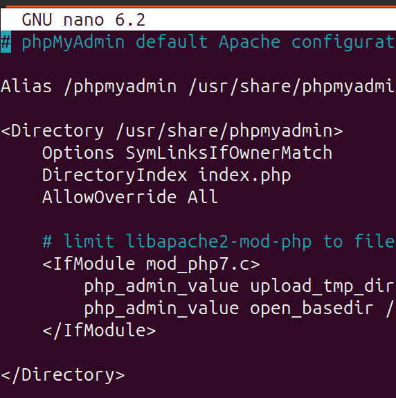
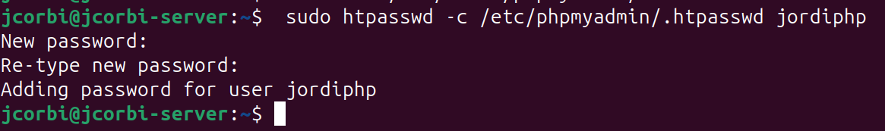
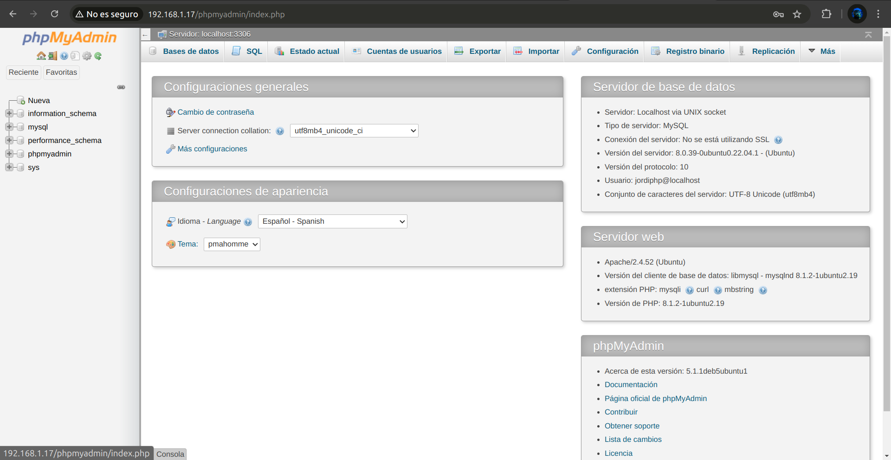

# Practica 03: Instalar, configurar y securizar phpMyAdmin

!!! success "Objetivos de la práctica"

    - Instalar, asegurar y configurar phpMyAdmin en un servidor Ubuntu.
    - Proteger PhpMyAdmin contra accesos no autorizados.
    - Automatizar la instalación y configuración de phpMyAdmin mediante scripts de Bash.

## Instalación de phpMyAdmin

1. Instala phpMyAdmin junto con las extensiones PHP necesarias (`php-mbstring`, `php-zip`, `php-gd`, `php-json`, `php-curl`).
    ```bash
     sudo apt update
    ```
      - **php-mbstring**: Un módulo para gestionar cadenas no ASCII y convertir cadenas a diferentes codificaciones
      - **php-zip**: Esta extensión soporta la carga de archivos .zip en phpMyAdmin
      - **php-gd**: Habilita el soporte para la Biblioteca Gráfica GD
      - **php-json**: Proporciona a PHP soporte para la serialización JSON
      - **php-curl**: Permite que PHP interactúe con diferentes tipos de servidores usando diferentes protocolos
    ```bash
     sudo apt install phpmyadmin php-mbstring php-zip php-gd php-json php-curl
    ```

2. Configura phpMyAdmin para que funcione con Apache.
Per a que php funcione en Apache2  tindrem que crear un usuari per a php i donar-li permisos.
```mysql 
mysql> create user 'phpmyadmin'@'localhost' identified by 'phpmyadmin';
mysql> grant all privileges on *.* to 'phpmyadmin'@'localhost';
mysql> flush privileges
```

3. Habilita la extensión mbstring y reinicia Apache.
Para habilitar explícitamente la extensión PHP mbstring, lo cual puedes hacer escribiendo:
```bash
 sudo phpenmod mbstring
```

**Figura.1** Comprovación phpmyadmin

### Cómo automatizar la instalación de LAMP
```bash
# Instalar PHP
sudo apt update -y 
sudo apt install php libapache2-mod-php -y

# Paquetes Opcionales
sudo apt install php-cli -y
sudo apt install php-cgi -y
sudo apt install php-mysql -y
sudo apt install php-pgsql -y

# Instalar phpmyadmin
sudo apt install phpmyadmin php-mbstring php-zip php-gd php-json php-curl -y    

# Acceder a MySQL para modificar configuración
sudo mysql -e 'UNINSTALL COMPONENT "file://component_validate_password";'

# Crear un nuevo usuario en MySQL con todos los privilegios
sudo mysql -e "CREATE USER 'phpmyadmin'@'localhost' IDENTIFIED BY 'phpmyadmin';"
sudo mysql -e "GRANT ALL PRIVILEGES ON *.* TO 'phpmyadmin'@'localhost' WITH GRANT OPTION;"
sudo mysql -e "FLUSH PRIVILEGES;"

# Reiniciar servidor Apache
sudo systemctl restart apache2
```
[Descargar install_phpmyadmin.sh](scripts/install_phpmyadmin.sh){ .md-button .md-button--primary }

## 1. Configuración del Acceso por Contraseña para la Cuenta Root de MySQL

1. Cambia el método de autenticación del usuario root de MySQL de auth_socket a caching_sha2_password o mysql_native_password.
      - Accedemos a la base de datos:
```bash
 sudo mysql
```
      - A continuación, verifica qué método de autenticación usa cada una de tus cuentas de usuario de MySQL con el siguiente comando:
```mysql
mysql> SELECT user,authentication_string,plugin,host FROM mysql.user;
```
      - Cambiar metodo de **authentificación** y contraseña.
```mysql
mysql> ALTER USER 'root'@'localhost' IDENTIFIED WITH 'caching_sha2_password' BY 'Root_pass1';
```

2. Verifica los métodos de autenticación empleados por cada uno de tus usuarios.

       - A continuación, verifica qué método de autenticación usa cada una de tus cuentas de usuario de MySQL con el siguiente comando: 
```mysql
mysql> SELECT user,authentication_string,plugin,host FROM mysql.user;
```

## 2. Configuración del Acceso por Contraseña para un Usuario Dedicado de MySQL

1. Crea un nuevo usuario de MySQL con una contraseña segura.
```mysql
mysql> create user 'jordiphp'@'localhost' identified by 'jordiphp';
```

2. Otorga al nuevo usuario los privilegios apropiados para gestionar las bases de datos a través de phpMyAdmin.
```mysql
mysql> grant all privileges on *.* to 'jordiphp'@'localhost';
mysql> flush privileges
```


## 3. Asegurando tu Instancia de phpMyAdmin

1. Habilita el uso de sobrescrituras de archivos .htaccess en la configuración de Apache para phpMyAdmin.

      - Usa tu editor de texto preferido para editar el archivo phpmyadmin.conf que se ha colocado en el directorio de configuración de Apache. Aquí, usaremos nano:
```bash
 sudo nano /etc/apache2/conf-available/phpmyadmin.conf
```
      - Agrega una directiva **AllowOverride** All dentro de la sección <Directory /usr/share/phpmyadmin> del archivo de configuración, así:
```bash
<Directory /usr/share/phpmyadmin>
        Options SymLinksIfOwnerMatch
        DirectoryIndex index.php
        AllowOverride All
        ...  # Otras directivas
</Directory>
```

      - Para implementar los cambios que realizaste, reinicia Apache:
```bash
 sudo systemctl restart apache2
```

2. Crea un archivo .htaccess en el directorio de phpMyAdmin para implementar autenticación básica.
      - Para que esto sea exitoso, el archivo debe ser creado dentro del directorio de la aplicación. Puedes crear el archivo necesario y abrirlo en tu editor de texto con privilegios de root escribiendo:
```bash
 sudo nano /usr/share/phpmyadmin/.htaccess
```
      - Dentro de este archivo, ingresa la siguiente información:
```bash
AuthType Basic
AuthName "Restricted Files"
AuthUserFile /etc/phpmyadmin/.htpasswd
Require valid-user
```

3. Crea un archivo .htpasswd para almacenar las credenciales de usuario y contraseña.
      
      - Ahora puedes crear este archivo y asignarle un usuario inicial con la utilidad htpasswd:
```bash
 sudo htpasswd -c /etc/phpmyadmin/.htpasswd jordiphp
```


      - Si deseas agregar un usuario adicional, debes hacerlo sin la bandera -c, así:
```bash
sudo htpasswd /etc/phpmyadmin/.htpasswd usuarioadicional
```

4. Reinicia Apache para aplicar los cambios.

      - Luego, reinicia Apache para aplicar la autenticación de .htaccess:  
```bash
sudo systemctl restart apache2 
```
 