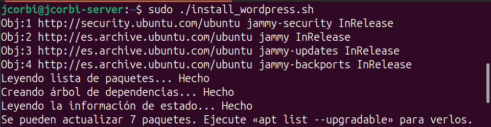
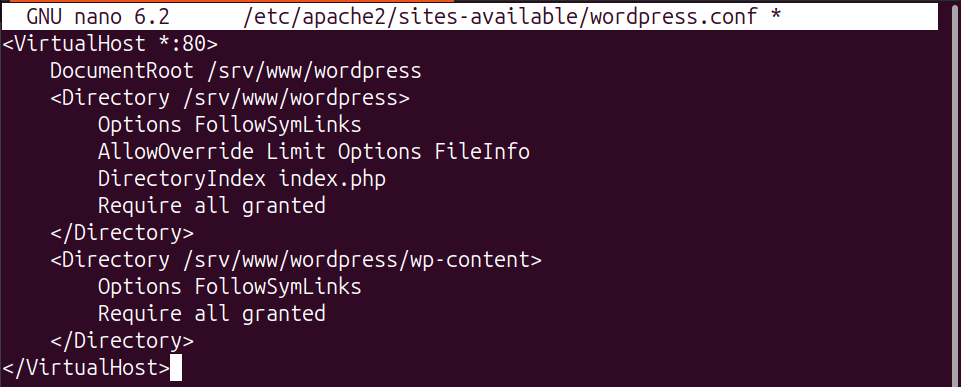
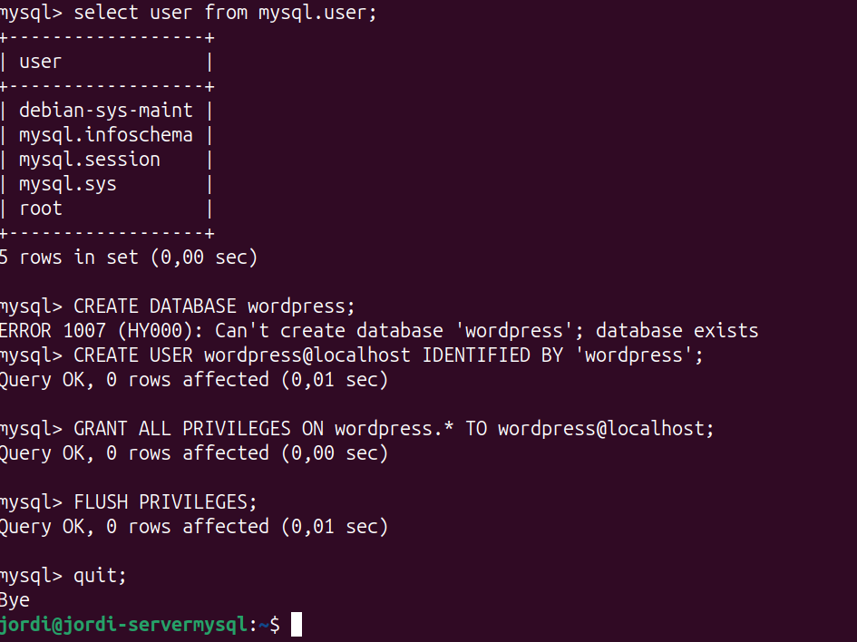
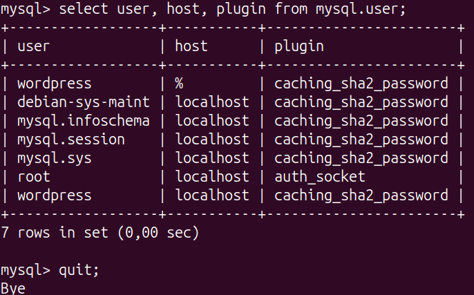
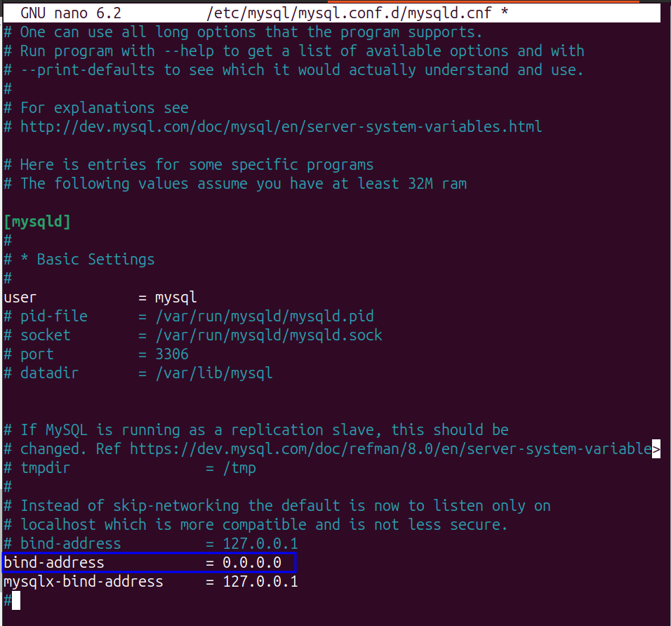
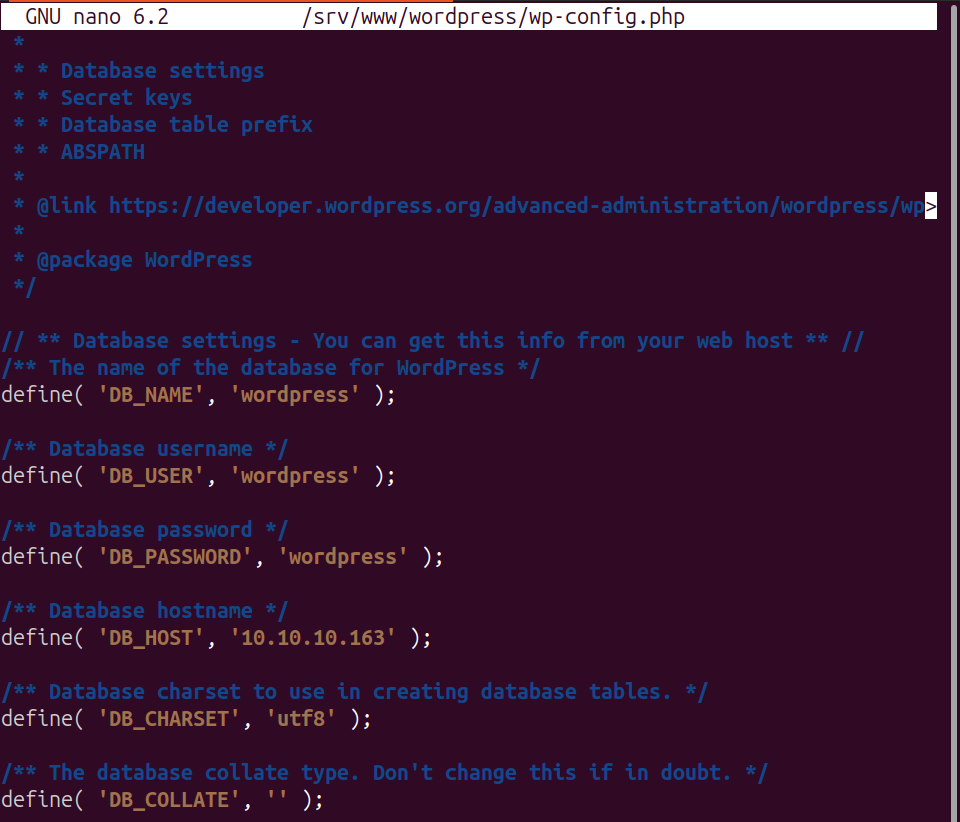
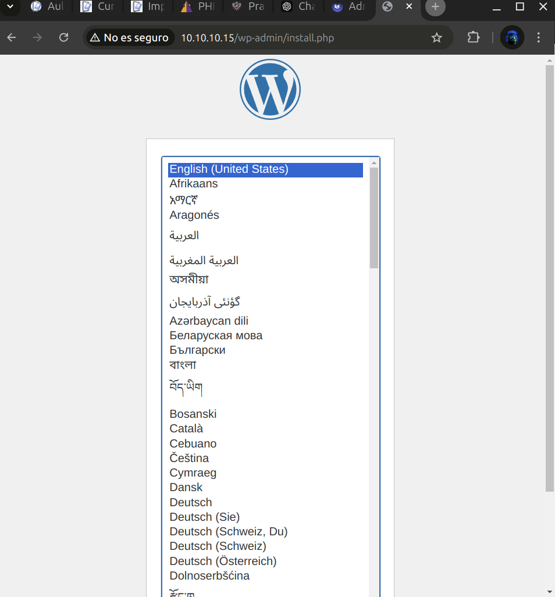
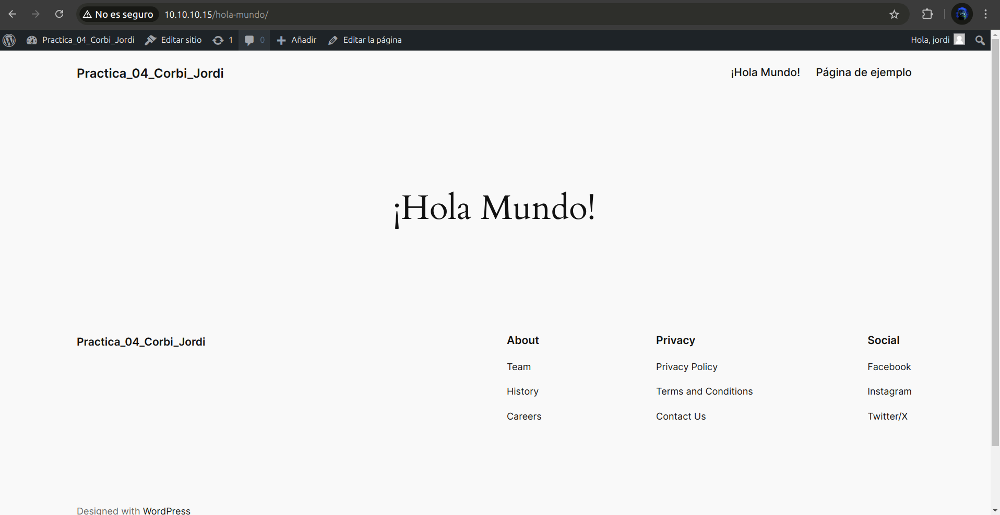

# PHP Práctica 4: Instalación y Configuración de WordPress

## 1. Descripción General

En esta práctica, instalaremos WordPress en un servidor Apache2 y configuraremos una base de datos MySQL. Implementaremos WordPress en una arquitectura LAMP (Linux, Apache, MySQL, PHP) de dos niveles.

!!! success "Objetivos"

    - Instalar PHP y Apache.
    - Instalar WordPress.
    - Configurar Apache para WordPress.
    - Configurar la base de datos.
    - Implementar la aplicación en una arquitectura de 2 niveles.

## 2. Instalación de Dependencias

Actualiza e instala los paquetes necesarios:

```bash
sudo apt update
sudo apt install apache2 ghostscript libapache2-mod-php php php-bcmath php-curl php-imagick php-intl php-json php-mbstring php-mysql php-xml php-zip
```

## 3. Instalación de WordPress

Descarga WordPress en el servidor:

```bash
sudo mkdir -p /srv/www
sudo chown www-data: /srv/www
curl https://wordpress.org/latest.tar.gz | sudo -u www-data tar zx -C /srv/www
```

**Figura.1:**Para la instalación de Wordpress lanzamos el script de instalación.
[Script Wordpress](script/install_wordpress.sh){ .md-button .md-button--primary }

## 4. Configuración de Apache para WordPress

Crea y habilita el sitio para WordPress:

```bash
sudo nano /etc/apache2/sites-available/wordpress.conf
```

Añade el siguiente contenido:

```apache
<VirtualHost *:80>
    DocumentRoot /srv/www/wordpress
    <Directory /srv/www/wordpress>
        Options FollowSymLinks
        AllowOverride Limit Options FileInfo
        DirectoryIndex index.php
        Require all granted
    </Directory>
    <Directory /srv/www/wordpress/wp-content>
        Options FollowSymLinks
        Require all granted
    </Directory>
</VirtualHost>
```

**Figura.2:**Crear fichero wordpress.conf
Habilita el sitio y módulos de Apache:

```bash
sudo a2ensite wordpress
sudo a2enmod rewrite
sudo a2dissite 000-default
sudo service apache2 reload
```

## 5. Configuración de la Base de Datos

Crea la base de datos y el usuario para WordPress en MySQL:
!!! info "NOTA"

    - Esto lo hacemos en la Maquina Virtual donde solo tenemos instalado MySQL.
```bash
sudo mysql -u root
CREATE DATABASE wordpress;
CREATE USER wordpress@localhost IDENTIFIED BY 'tu-contraseña';
GRANT ALL PRIVILEGES ON wordpress.* TO wordpress@localhost;
FLUSH PRIVILEGES;
quit;
```

**Figura.3:**Crear usuario wordpres en la base de datos.


**Figura.4:**Crear usuario wordpres en acces remot en la base de datos.


**Figura.5:**Habilitamos el acceso remoto en el fichero de conf de mysql.

## 6. Conexión de WordPress con la Base de Datos

Configura el archivo `wp-config.php` con los detalles de la base de datos:

```bash
sudo -u www-data cp /srv/www/wordpress/wp-config-sample.php /srv/www/wordpress/wp-config.php
sudo -u www-data sed -i 's/database_name_here/wordpress/' /srv/www/wordpress/wp-config.php
sudo -u www-data sed -i 's/username_here/wordpress/' /srv/www/wordpress/wp-config.php
sudo -u www-data sed -i 's/password_here/tu-contraseña/' /srv/www/wordpress/wp-config.php
```

Finalmente, en una sesión de terminal abre el archivo de configuración en nano:
```bash
sudo -u www-data nano /srv/www/wordpress/wp-config.php
```

**Figura.6:**Modificamos el fichero de `wp-config.php`.


## 7. Configuración Final de WordPress

Accede a `http://localhost` y completa la instalación en el navegador.

**Figura.7:**Acceder a Wordpress.

## 8. Publica tu Primer Post

Borra la publicación "¡Hola Mundo!" y crea una nueva en el panel de WordPress.


**Figura.8:**Pagina publicada.