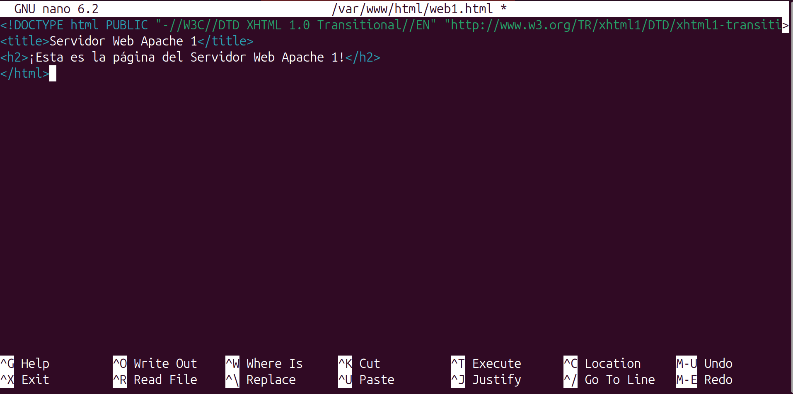
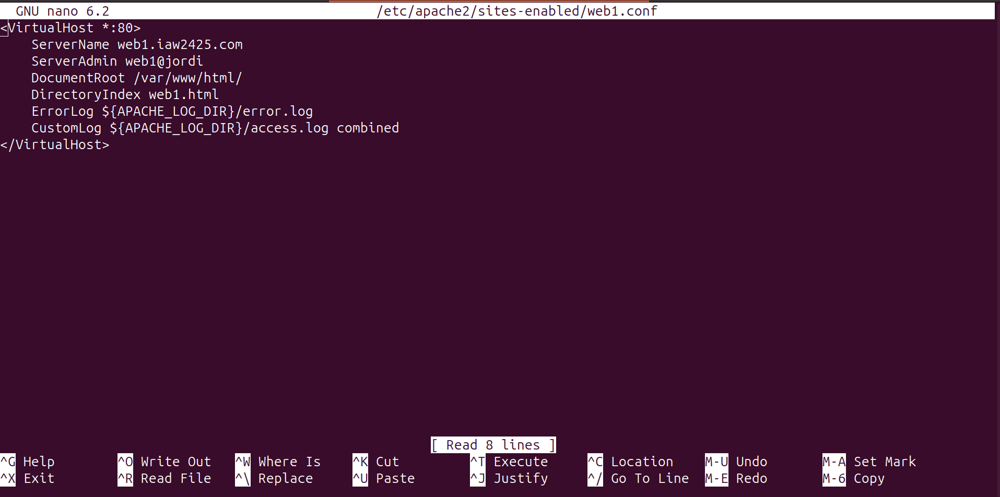
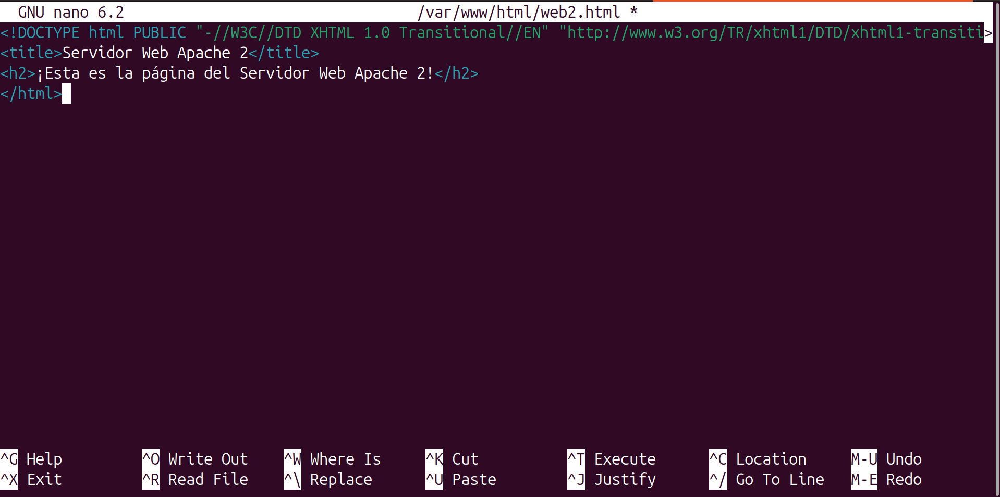
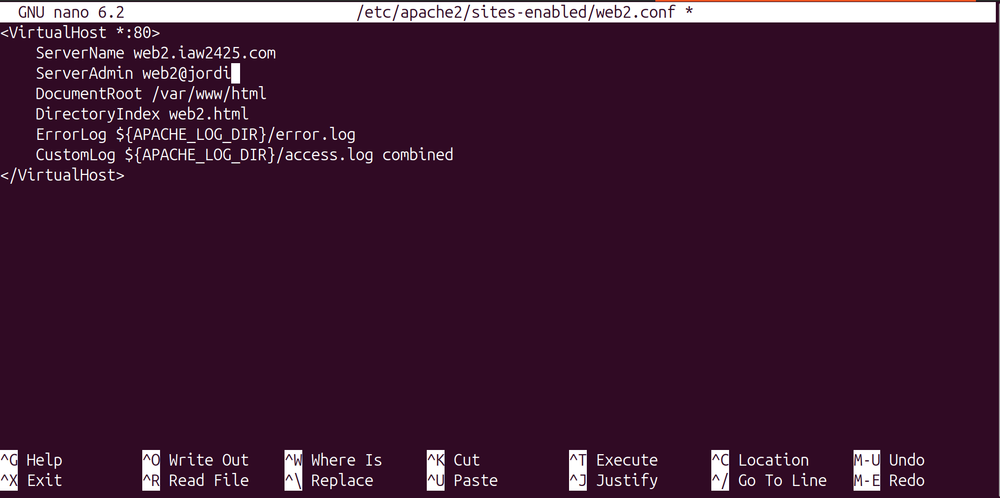
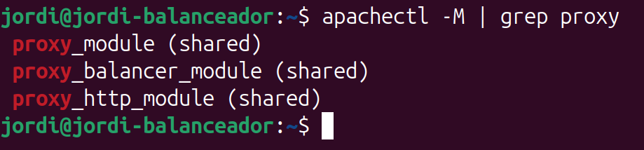
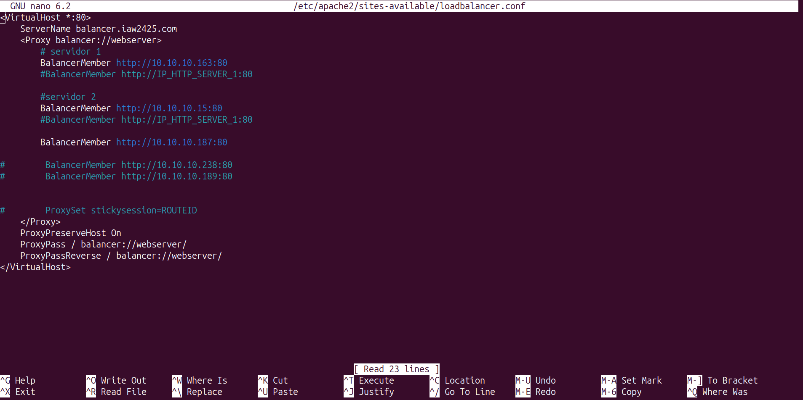
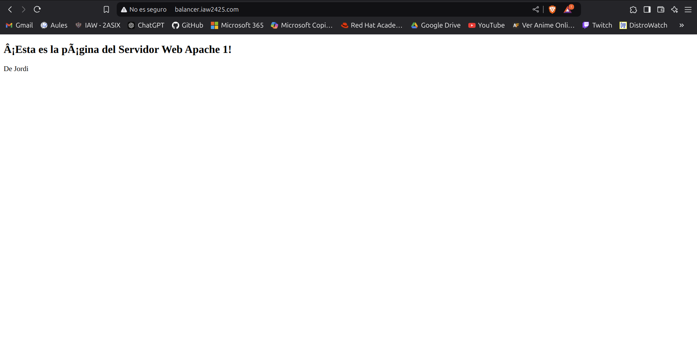
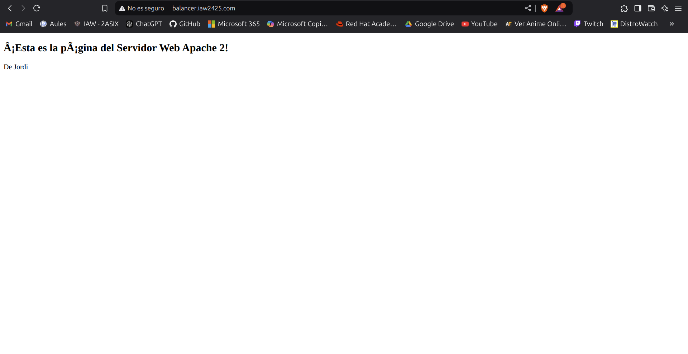

# Práctica Evaluable 5: Balanceo de carga con Apache

!!! success "Objetivos"

    1. Instalación de Apache y Módulos Necesarios¶
    2. Configurar el Primer Servidor Backend Apache¶
    3. Crear un Balanceador de Carga Apache¶
    4. Configuración de la Política de Balanceo de Carga¶
    5. Verificar el Balanceo de Carga con Apache¶
    6. Ampliación de la práctica 5: Balanceo de carga con Apache

## Introducción
En esta práctica aprenderemos a implementar el balanceo de carga con Apache utilizando varios servidores backend. El objetivo es distribuir el tráfico entre varios servidores para garantizar la disponibilidad y mejorar el rendimiento de la aplicación web.


## Requisitos

- **Sistema Operativo:** Cualquier distribución de Linux (preferiblemente Ubuntu o CentOS).
- **Software necesario:**
  - Apache HTTP Server
  - Módulos `mod_proxy` y `mod_proxy_balancer` habilitados
  - Varios servidores backend simulados (pueden ser virtuales o en la nube)
  - Firewall y SELinux deshabilitados o configurados correctamente.

## Configuración de Apache para Balanceo de Carga

### 1. Instalación de Apache y Módulos Necesarios
Primero, instalaremos Apache y los módulos necesarios para el balanceo de carga.

```bash
sudo apt-get update
sudo apt-get install apache2
```
### 2. Configurar el Primer Servidor Backend Apache
Crea una página HTML de muestra y un archivo de configuración de host virtual en el primer servidor Apache:
```bash
nano /var/www/html/web1.html
```
Agrega el siguiente código HTML:
```html
<!DOCTYPE html PUBLIC "-//W3C//DTD XHTML 1.0 Transitional//EN" "http://www.w3.org/TR/xhtml1/DTD/xhtml1-transitional.dtd">
<title>Servidor Web Apache 1</title>
<h2>¡Esta es la página del Servidor Web Apache 1!</h2>
</html>
```

Guarda y cierra el archivo.

Crea el archivo de configuración del host virtual:
```bash
nano /etc/apache2/sites-enabled/web1.conf
```
Agrega las siguientes configuraciones:
```bash
<VirtualHost *:80>
    ServerName web1.iaw2425.com
    ServerAdmin webmaster@localhost
    DocumentRoot /var/www/html
    DirectoryIndex web2.html
    ErrorLog ${APACHE_LOG_DIR}/error.log
    CustomLog ${APACHE_LOG_DIR}/access.log combined
</VirtualHost>
```

Guarda y cierra el archivo, luego reinicia el servicio Apache:
```bash
systemctl restart apache2
```
### 3. Configurar el Segundo Servidor Backend Apache
Crea una página HTML de muestra y un archivo de configuración de host virtual en el primer servidor Apache:
```bash
nano /var/www/html/web2.html
```
Agrega el siguiente código HTML:
```html
<!DOCTYPE html PUBLIC "-//W3C//DTD XHTML 1.0 Transitional//EN" "http://www.w3.org/TR/xhtml1/DTD/xhtml1-transitional.dtd">
<title>Servidor Web Apache 2</title>
<h2>¡Esta es la página del Servidor Web Apache 2!</h2>
</html>
```

Guarda y cierra el archivo.

Crea el archivo de configuración del host virtual:
```bash
nano /etc/apache2/sites-enabled/web2.conf
```
Agrega las siguientes configuraciones:
```apache
<VirtualHost *:80>
    ServerName web2.iaw2425.com
    ServerAdmin webmaster@localhost
    DocumentRoot /var/www/html
    DirectoryIndex web2.html
    ErrorLog ${APACHE_LOG_DIR}/error.log
    CustomLog ${APACHE_LOG_DIR}/access.log combined
</VirtualHost>
```

Guarda y cierra el archivo, luego reinicia el servicio Apache:
```bash
systemctl restart apache2
```
### 4. Crear un Balanceador de Carga Apache

Configura el tercer servidor como un servidor de balanceo de carga para redirigir todo el tráfico a ambos servidores web backend.

Habilita los módulos proxy en el servidor de balanceo de carga:
```bash
sudo a2enmod proxy
sudo a2enmod proxy_http
sudo a2enmod proxy_balancer
sudo a2enmod lbmethod_byrequests
```

!!! info "Módulos de Apache"

    - Proxy: Habilita el módulo proxy de Apache.
    - Proxy_http: Habilita el módulo de proxy HTTP de Apache.
    - Proxy_balancer: Habilita el módulo de balanceador de carga de Apache.


Reinicia el servicio Apache:
```bash
systemctl restart apache2
```

Verifica todos los módulos proxy:
```bash
apachectl -M | grep proxy
```

Crea un archivo de configuración de Apache para el balanceo de carga:
```bash
nano /etc/apache2/sites-enabled/loadbalancer.conf
```
Agrega las siguientes configuraciones:

```apache
<VirtualHost *:80>
    ServerName balancer.iaw2425.com
    <Proxy balancer://webserver>
        # servidor 1
        BalancerMember http://web1.iaw2425.com
        #BalancerMember http://IP_HTTP_SERVER_1:80

        #servidor 2
        BalancerMember http://web2.iaw2425.com
        #BalancerMember http://IP_HTTP_SERVER_1:80

        ProxySet stickysession=ROUTEID
    </Proxy>
    ProxyPreserveHost On
    ProxyPass / balancer://webserver/
    ProxyPassReverse / balancer://webserver/
</VirtualHost>
```


### 5. Configuración de la Política de Balanceo de Carga
Para configurar la política de balanceo de carga es necesario tener activado previamente el módulo `proxy_balancer` con el siguiente comando:
```bash
sudo a2enmod proxy_balancer
```
Para activar este método de balanceo tenemos que activar el módulo `lbmethod_byrequests`:
```bash
sudo a2enmod lbmethod_byrequests
```
Este método de balanceo también permite distribuir las peticiones entre los servidores en función de los parámetros `lbfactor` y `lbstatus`. Puedes consultar más información sobre este módulo en la [documentación oficial](https://httpd.apache.org/docs/2.4/mod/mod_lbmethod_byrequests.html).

Recuerde que después de habilitar los módulos es necesario reiniciar el servicio de Apache:
```bash
systemctl restart apache2
```

### 6. Verificar el Balanceo de Carga con Apache

Abre tu navegador web y accede al balanceador de carga usando la URL `http://balancer.iaw2425.com`. Deberías ver la página de tu primer servidor backend.

Espera un tiempo y actualiza la página. Esta vez, deberías ver la página HTML de muestra de tu segundo servidor backend.




### Ampliación de la Práctica

1. Configura el balanceo de carga con Apache para redirigir el tráfico a tres o más servidores web backend. Para ello, puedes agregar más servidores web backend y configurar el balanceador de carga con Apache. Utiliza los servidores creados por los compañeros de clase


2. Cambia la politica de balanceo de carga a diferentes métodos y verifica su funcionamiento. Puedes utilizar los métodos `lbmethod_bybusyness`, `lbmethod_bytraffic`, o `lbmethod_heartbeat`


### Comprobación de la Práctica
Puedes usar el formato de registro personalizado para hacer esto. Una forma de lograrlo es agregando la variable de entorno al registro.

El `módulo mod_proxy_balancer` exporta la variable `BALANCER_WORKER_NAME`, que es el nombre del método utilizado para la solicitud. Puedes usar la directiva `%{BALANCER_WORKER_NAME}`e en tu cadena de formato de registro personalizado para que se registre.

Aquí tenéis un ejemplo del formato de registro ‘combined’ predeterminado de Debian con la directiva añadida:
```bash

``LogFormat "%h %l %u %t \"%r\" %>s %b \"%{Referer}i\" \"%{User-Agent}i\" \"%{BALANCER_WORKER_NAME}e\"" combined
