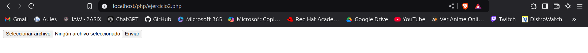
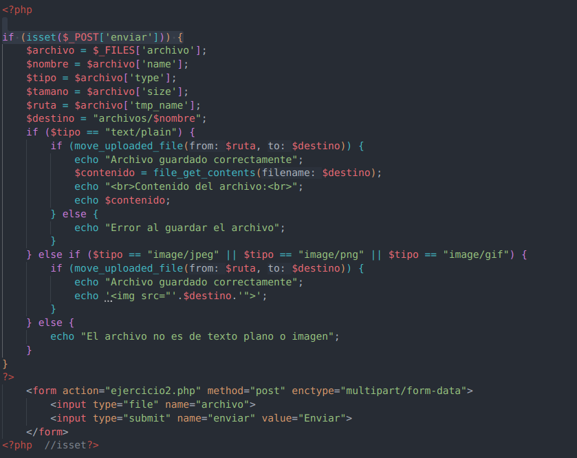

# Practica 1:Implantación de una web estática con Apache

!!! success "Objetivos de la práctica"

     -Validación y Control: Aprender a validar formularios y manejar errores en la entrada de datos.
     - Gestión de Sesiones HTTP: Comprender las diferencias entre los métodos de envío de datos (POST vs. GET).
     - Manipulación de Archivos: Desarrollar habilidades en la gestión y procesamiento de archivos subidos al servidor.
     - Interacción Dinámica: Crear una experiencia de usuario interactiva al mostrar los datos y los mensajes personalizados según la entrada.

## Formulario A

1. Crear un formulario que permita ingresar los datos de una persona (nombre, apellido, edad, dirección, teléfono, correo electrónico) y mostrarlos en la misma página una vez que se presione el botón de enviar. Además, se debe validar que los campos no estén vacíos.

2. Modificar el formulario para que se pueda seleccionar el género de la persona (masculino, femenino, otro) y mostrarlo en la página.

3. Modificar el formulario para que se pueda seleccionar los idiomas que habla la persona (español, inglés, francés, alemán, italiano) y mostrarlos en la página. Al darle al botón de enviar, se debe mostrar un mensaje de bienvenida en ese idioma. Puede haber varios idiomas, y si no seleccionó ninguno, mostrar un mensaje que indique que no seleccionó ningún idioma.

## Ampliación del formulario para enviar mediante POST

Partiendo del ejercicio anterior, modificar el formulario para que se envie la información mediante método POST a otra página llamada “procesar.php”. En esta página, mostrar los datos ingresados en el formulario, igual que el ejercicio anterior y sus modificaciones.

Prueba el formulario con diferentes datos y cambia el metodo de envío de POST a GET. ¿Qué diferencias observas?

## Formulario B. Enviar un fichero por formulario

Crea un formulario que permita enviar un archivo de texto. El archivo debe ser guardado en el servidor y mostrar un mensaje indicando que se ha guardado correctamente. Además, mostrar el contenido del archivo en la página.

Archivo: ejercicio2.php

