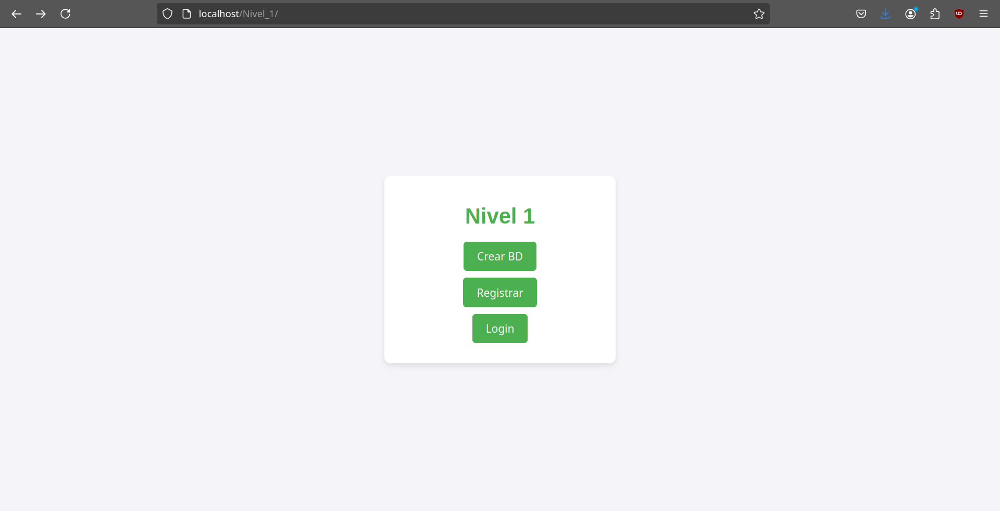
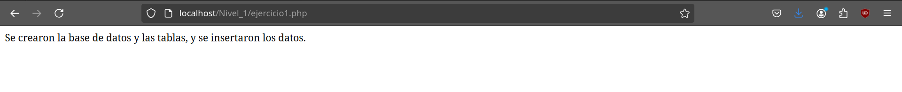
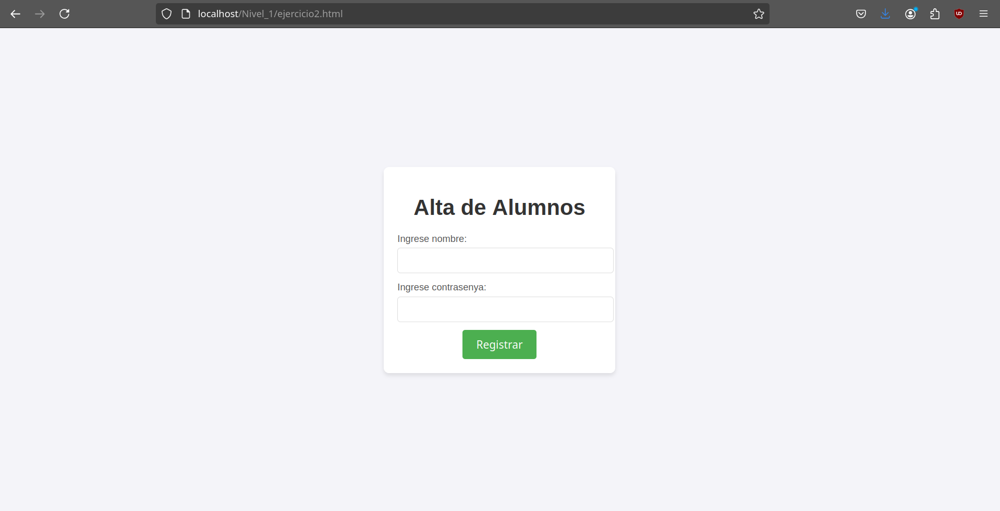
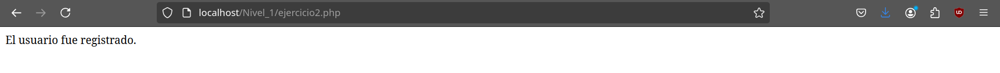
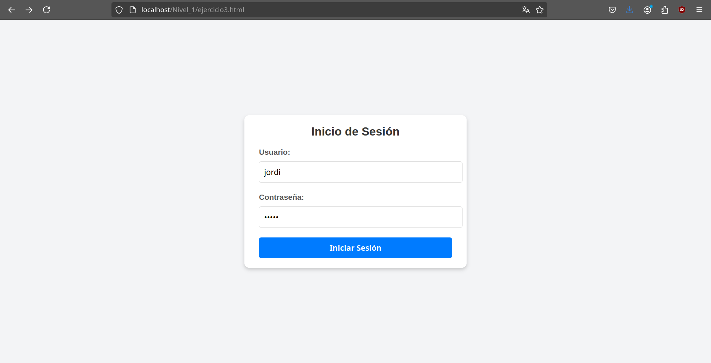
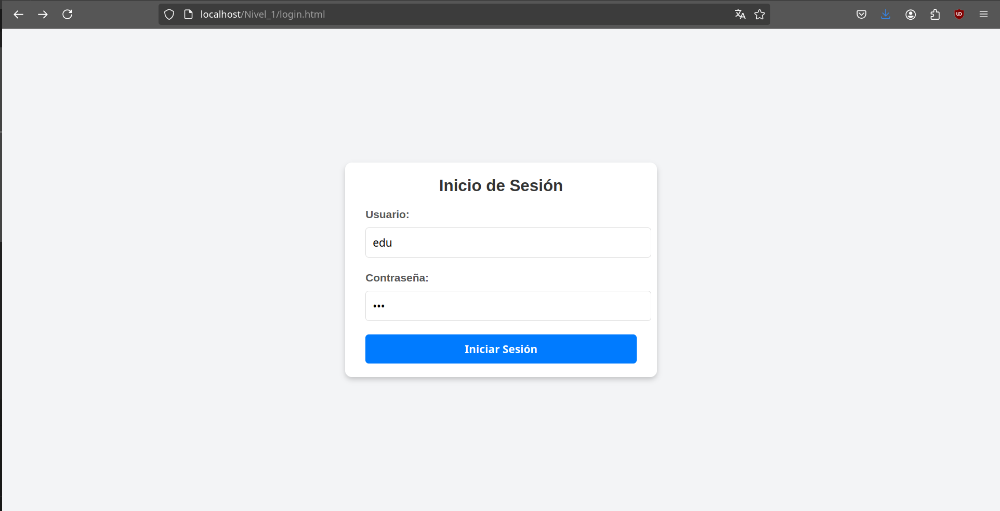
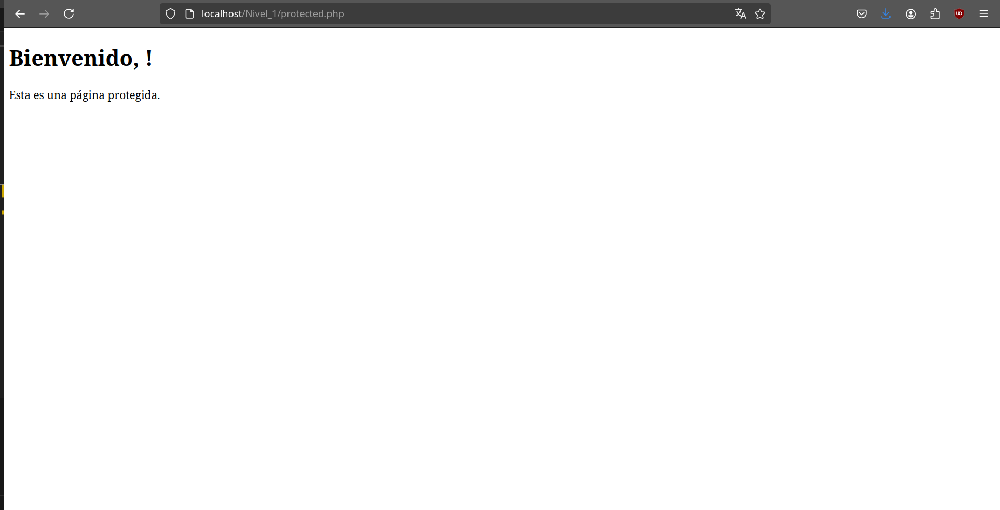
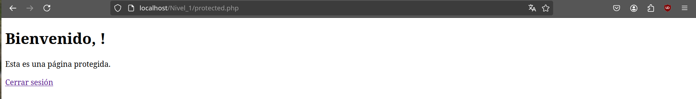
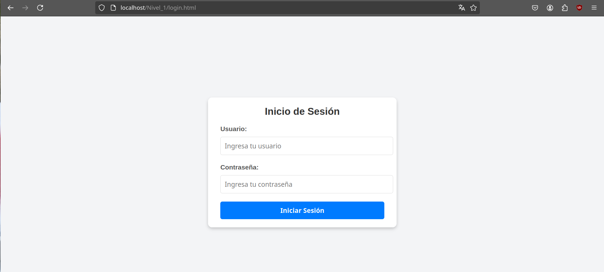

# Proyecto 1 PHP - Sistema de autenticación de usuarios en PHP y MYSQL

## Nivel 1

### Descripción

1. **Crear una base de datos**: Diseñar una base de datos MySQL para almacenar la información de los usuarios.

    

    

    [CrearBD.php](crearbd.php){ .md-button .md-button--primary }

2. **Formulario de Registro**: Crear un formulario en HTML para que los usuarios puedan registrarse.

    

    

    [Registrar.php](registrar.php){ .md-button .md-button--primary }

3. **Validación y Almacenamiento**: Utilizar PHP para validar los datos del formulario y almacenarlos en la base de datos.

    Con el codigo de php validamos los datos del formulario y los almacenamos en la base de datos.

4. **Formulario de Inicio de Sesión**: Crear un formulario de inicio de sesión en HTML.

    

    [login.html](login.html){ .md-button .md-button--primary }

5. **Autenticación**: Utilizar PHP para verificar las credenciales del usuario y permitir el acceso a una página protegida.

    

    

    [login.php](login.php){ .md-button .md-button--primary }

6. **Control de Sesiones**: Implementar el manejo de sesiones en PHP para mantener al usuario autenticado.

Para hacer un control de sesiones *utilizarem la variable de $_*Sessio.

Tendremos que pasar la variable de *sessio cuando basura *login y *despres tendremos que *comprobar en la *pagina redirigida de *login.

Y *despres haremos un *logout.*php para cerrar la *sessio.

I como podemos ver al clic en cerrar session volvemos al login.

[logout.php](logout.php){ .md-button .md-button--primary }

## Nivel 2

### Descripción

Crear una aplicación para gestionar bases de datos (SGBD) tipo PHPMyAdmin con las siguientes características:

1. **Página de Inicio**: Mostrar un mensaje de bienvenida donde se muestre el formulario de inicio de sesión, si el usuario no está autenticado. Si el usuario está autenticado, mostrar un mensaje de bienvenida y un botón para cerrar sesión.

2. **Menú de Navegación de usuarios**: Crear un menú de navegación con las opciones: Inicio, Perfil, Usuarios y Salir.

3. **Menú de Navegación de las bases de datos**: Crear un menú de navegación con las opciones: Bases de datos, Tablas, Consultas, Importar y Exportar, etc.

4. **Perfil de Usuario**: Mostrar la información del usuario autenticado.

5. **Gestión de Usuarios**: Crear una tabla con la lista de usuarios registrados en la base de datos.
