# Implementación de un Sistema de Login y Registro Seguro en PHP

!!! success "Objetivos de la práctica"
    - El objetivo de esta actividad es que desarrolles un sistema funcional de login y registro de usuarios en PHP utilizando MySQLi. Pondrás en práctica conceptos de seguridad, validación de datos, manejo de sesiones y generación de CAPTCHA para garantizar la funcionalidad y protección del sistema.

### Funcionalidades 

**Formulario de Registro**

Formulario de registro para ingresar datos de usuario y contraseña en la base de datos.

Formulario HTML

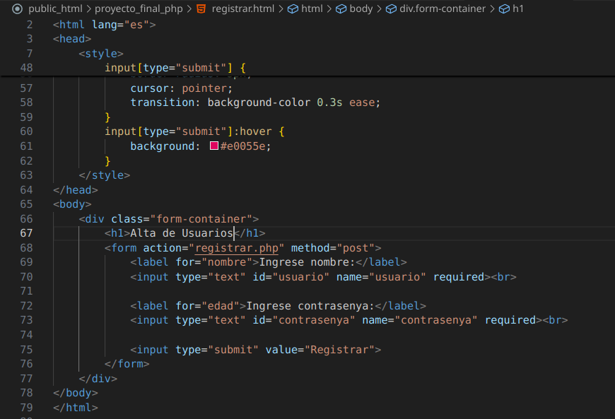
**Figura 1 :** Formulario de registro

Formulario PHP

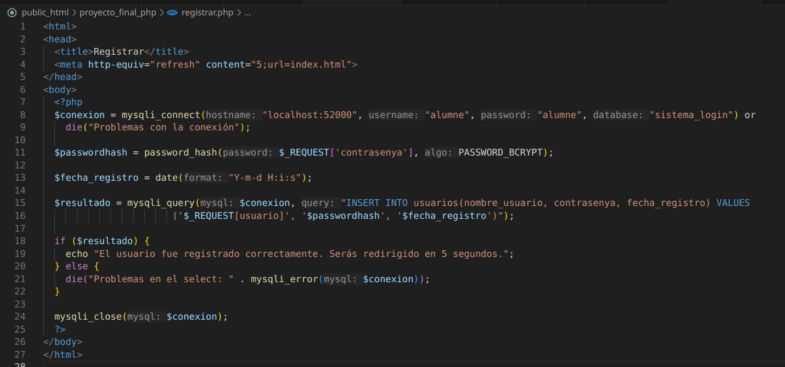
**Figura 2 :** Formulario de registro

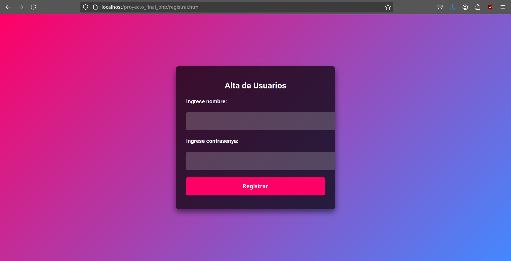
**Figura 3 :** Formulario de registro

Datos Ingresados despues del registro.

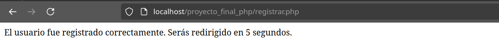
**Figura 4 :** Formulario de registro

**Formulario de Login**

Login HTML

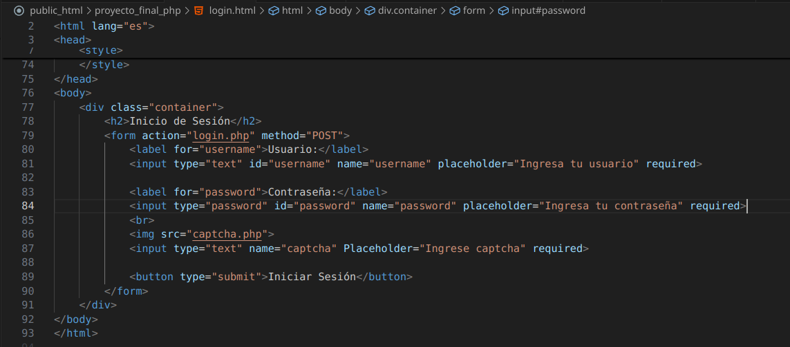
**Figura 5 :** Formulario de login

Login PHP

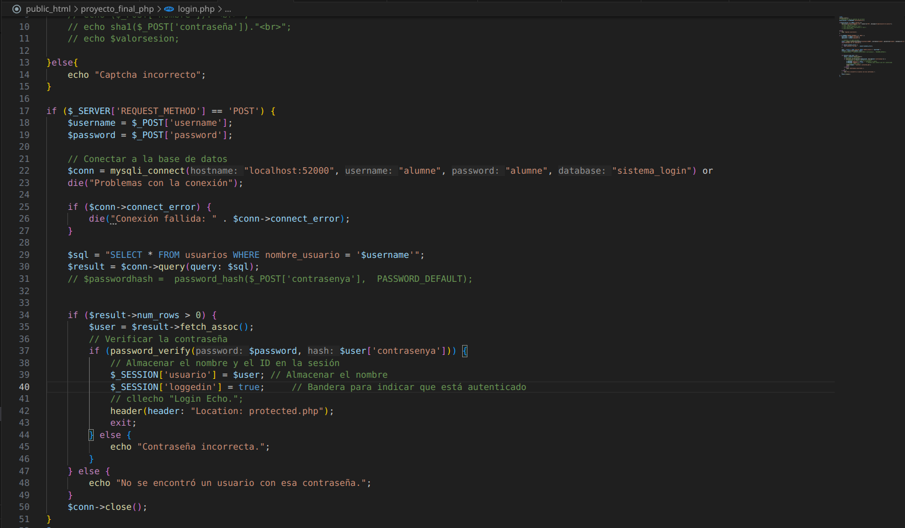
**Figura 6 :** Formulario de login

Pagina de login.

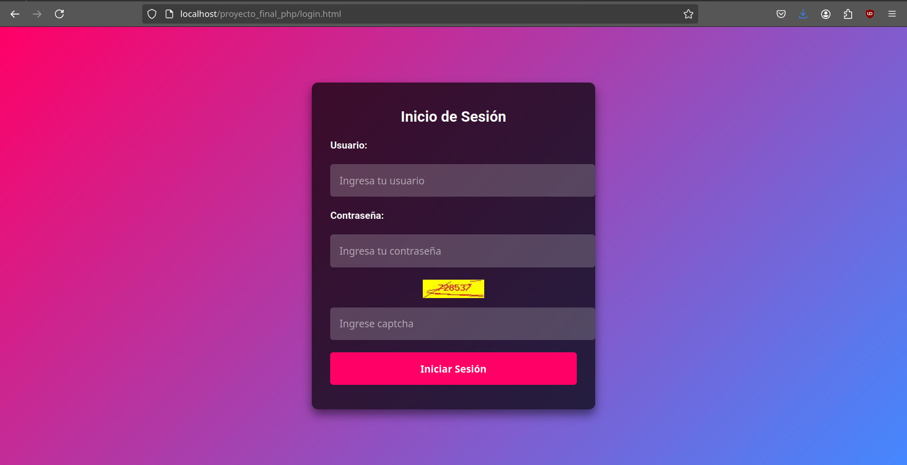
**Figura 7 :** Formulario de login

Pagina de login despues de ingresar datos.
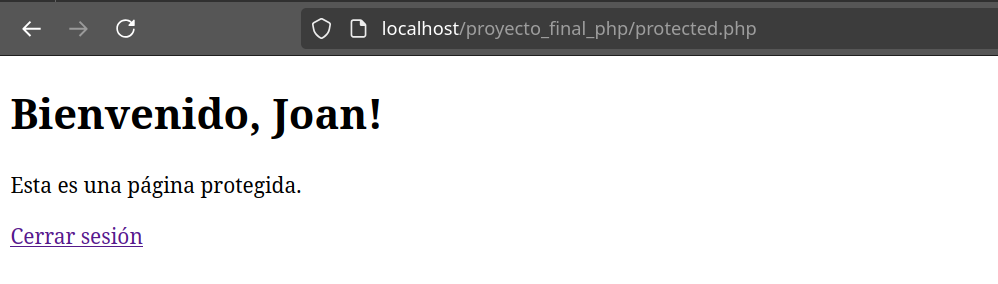
**Figura 8 :** Formulario de login

**Gestión de Sesiones**

Usa **$_SESSION** para mantener el estado del usuario una vez logueado.

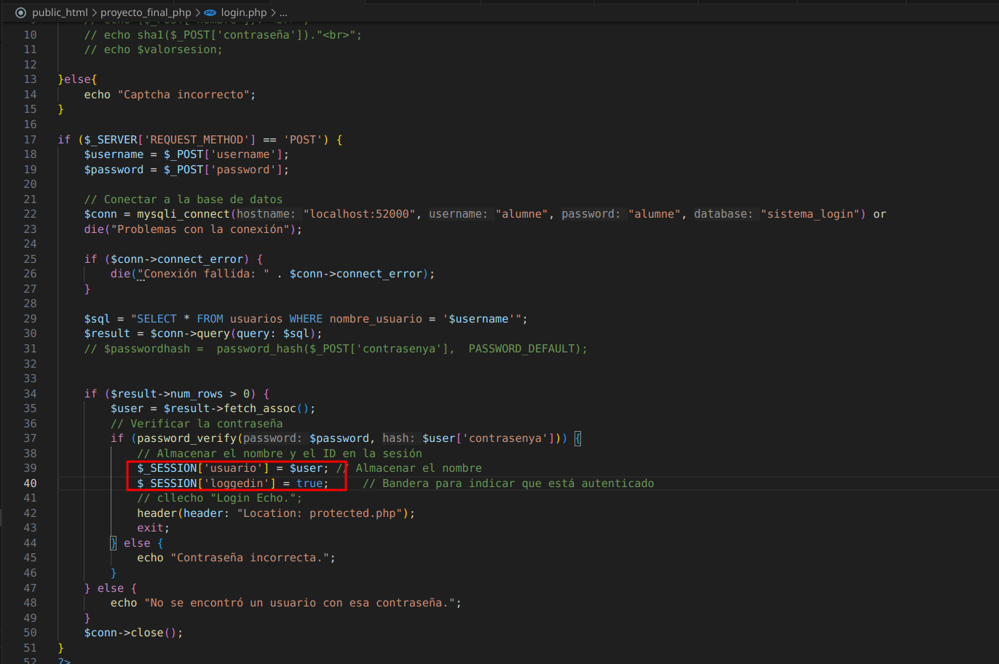
**Figura 9 :** Formulario de login

Comprobacion de que el usuario y contraseña sean correctos.

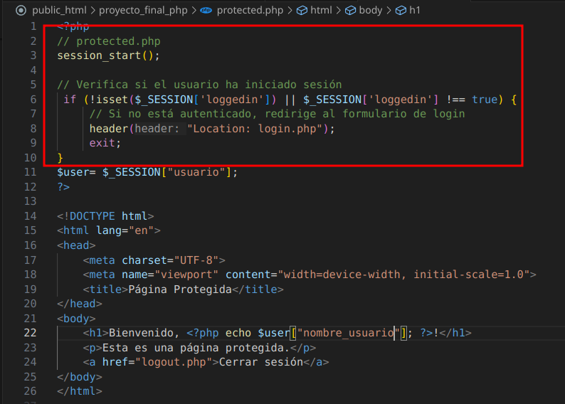
**Figura 10 :** Formulario de login

Si el login es exitoso, inicia una sesión con tu nombre de usuario.

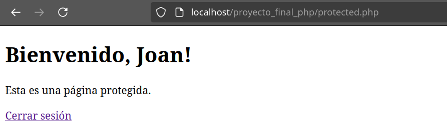
**Figura 11 :** Formulario de login

**CAPTCHA Dinámico**

Imagen de el captcha quando haces login.

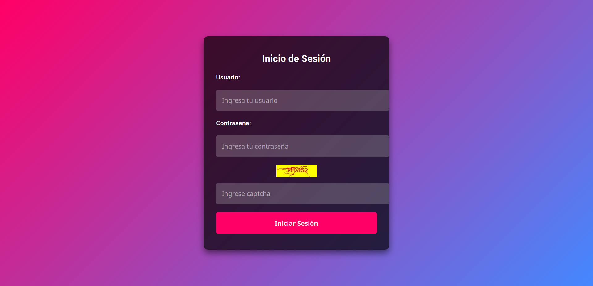
**Figura 12 :** Captcha

Comprobacion de el que el captcha sea correcto.

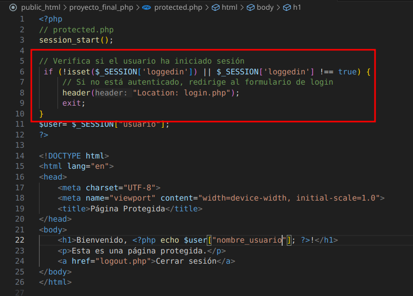
**Figura 14 :** Captcha

**Manejo de Fechas**

Para registrar la fecha usuaremos la variable $data y data de php.

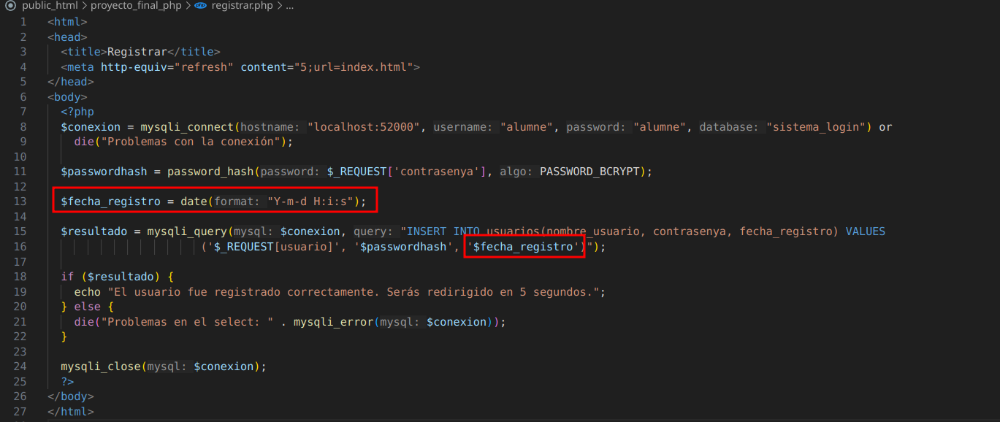
**Figura 15 :** Registar fecha

Comprobacion en la base de datos luego de registar un usuario.

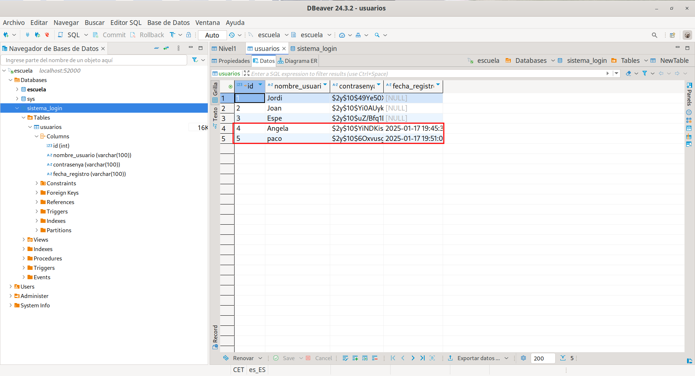
**Figura 16 :** Registar fecha

### Base de Datos

- Crea una base de datos llamada sistema_login.
- Define una tabla usuarios con los siguientes campos:
    - **id**: Clave primaria (entero, autoincremental).
    - **nombre_usuario**: Texto único (máximo 50 caracteres).
    - **contrasena**: Contraseña almacenada en formato hash.
    - **fecha_registro**: Fecha y hora del registro del usuario.

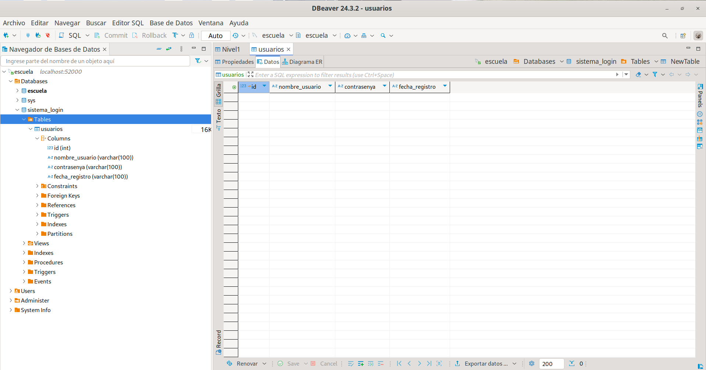
**Figura 17 :** Base de datos 