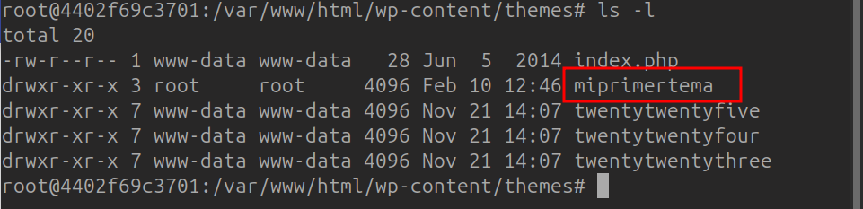
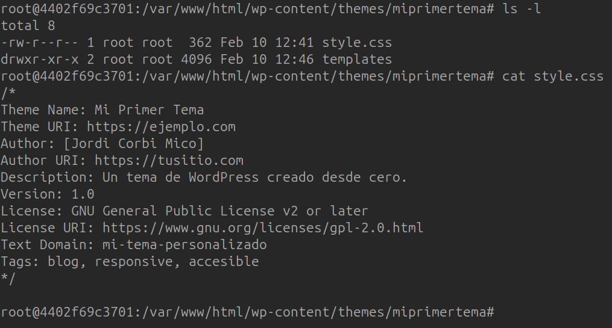
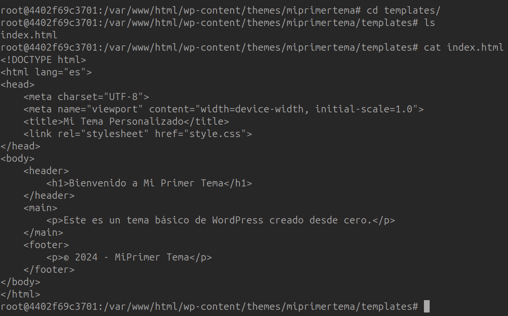
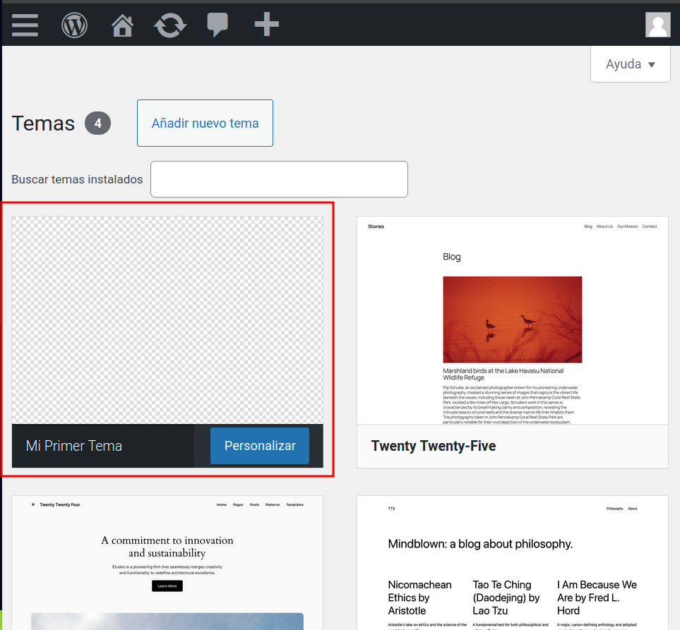
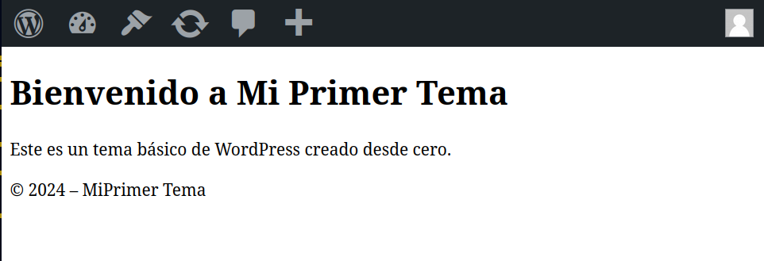

# 🎨 Creación de un Tema de WordPress desde Cero

## 🎯 Objetivo

Desarrollar un tema personalizado para WordPress desde cero, creando los archivos esenciales `style.css` e `index.php`, y organizando su estructura en las carpetas adecuadas.

---

## 🛠️ Parte 1: Configuración del Entorno

1. **Instalación de WordPress**:
   - Configura un entorno de desarrollo local utilizando herramientas como XAMPP, WAMP o Local by Flywheel.
   - Descarga la última versión de WordPress desde [wordpress.org](https://wordpress.org/) e instálala en tu entorno local.

2. **Acceso al Directorio de Temas**:
   - Navega al directorio de temas de WordPress:
     ```bash
     wp-content/themes/
     ```
3. **Creación de la carpeta del tema**:
   - Crea una carpeta en el directorio de temas de WordPress para tu tema personalizado:
   - Ejemplo: `wp-content/themes/mi-tema-personalizado`
   
---

## 📁 Parte 2: Creación de los Archivos Requeridos

1. **Creación del archivo `style.css`**:
   - Dentro de una nueva carpeta para tu tema (por ejemplo, `mi-tema-personalizado`), crea un archivo llamado `style.css`.
   - Añade la siguiente cabecera al archivo:
     ```css
     /*
     Theme Name: Mi Tema Personalizado
     Theme URI: http://ejemplo.com/mi-tema-personalizado
     Author: Tu Nombre
     Author URI: http://ejemplo.com
     Description: Una breve descripción de tu tema.
     Version: 1.0
     License: GNU General Public License v2 or later
     License URI: http://www.gnu.org/licenses/gpl-2.0.html
     Text Domain: mi-tema-personalizado
     */
     ```
   - Esta cabecera proporciona información esencial sobre tu tema a WordPress.
    

2. **Creación del archivo `index.php`**:
   - En el mismo directorio de tu tema dentro de la carpeta `templates`, crea un archivo llamado `index.php`.
   - Añade contenido HTML básico para probar el tema:
     ```php
     <!DOCTYPE html>
     <html <?php language_attributes(); ?>>
     <head>
         <meta charset="<?php bloginfo('charset'); ?>">
         <title><?php bloginfo('name'); ?></title>
         <link rel="stylesheet" href="<?php bloginfo('stylesheet_url'); ?>">
     </head>
     <body>
         <h1><?php bloginfo('name'); ?></h1>
         <p><?php bloginfo('description'); ?></p>
     </body>
     </html>
     ```
   - Este archivo sirve como la plantilla principal de tu tema.
  

---

## 🚀 Parte 3: Activación del Tema en WordPress

1. **Activar el Tema**:
   - Inicia sesión en el panel de administración de WordPress.
   - Ve a la sección de "Apariencia" y luego a "Temas".
   - Deberías ver tu tema "Mi Tema Personalizado" listado allí.
   - Haz clic en "Activar" para establecerlo como el tema activo de tu sitio.
  
  

2. **Verificación**:
   - Visita la página principal de tu sitio para asegurarte de que el tema se muestra correctamente.
   - Deberías ver el nombre y la descripción de tu sitio, tal como se definió en `index.php`.

  